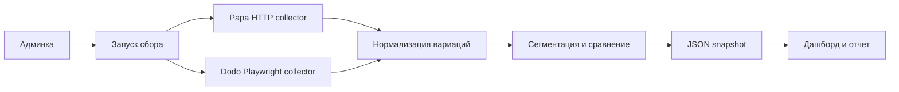

# Отчет: аналитика цен пицц

Дата: 8 июля 2026
Город: Москва  
Наш ресторан: https://papajohns.ru/moscow  
Конкурент: Dodo Pizza Москва, средняя по 142 ресторанам; контрольный URL https://dodopizza.ru/moscow/veshnyaki

## 1. Ограничение задачи

Текущий этап рассматривает только пиццы.

Исключены:

- комбо;
- закуски;
- горячее;
- напитки;
- завтраки;
- десерты;
- соусы;
- другие товары;
- римские пиццы Dodo как отдельная продуктовая линейка;
- пиццы из половинок;
- конструкторы "Создай свою пиццу" и "Соберите свою пиццу";
- модифицированные бортики и другие нестандартные края.

Цены анализируются как базовые цены вариаций со стандартным бортом, без промокодов, допов, замен ингредиентов и корзинных скидок.

## 2. Реализованный сборщик

Создан единый сборщик:

- `scripts/collect-pizzas.js`

Он пишет два файла:

- `data/pizza-snapshot.json` - машинный JSON-срез;
- `data/pizza-snapshot.js` - тот же срез для статического `index.html`.

Дополнительно для Dodo Pizza записываются:

- `data/dodo-restaurants-moscow.json` - список московских ресторанов со страницы контактов;
- `data/dodo-restaurants-moscow.js` - тот же список для статической страницы.

Команды:

```bash
npm run collect
npm run collect:papa
npm run collect:dodo
npm run collect:dodo:restaurants
npm run collect:dodo:moscow
```

Для быстрой отладки Dodo:

```bash
npm run collect -- --source=dodo --dodo-limit=5
npm run collect:dodo:moscow:test
```

## 3. Источники данных

### Papa Johns

Страница содержит `window.__PRELOADED_STATE__`.

Подход:

- HTTP-запрос к `https://papajohns.ru/moscow`;
- извлечение JS-состояния страницы;
- фильтрация товаров категории `pizza`;
- фильтрация только стандартного борта;
- нормализация вариаций по размеру, тесту, цене и весу.

Фактически извлечено:

- 44 пиццы после исключения конструктора "Создай свою пиццу";
- 289 вариаций со стандартным бортом.

Качество источника: высокое. Для регулярного сбора достаточно HTTP-запроса и JS/JSON-разбора состояния страницы.

### Dodo Pizza

Прямой HTTP-запрос к странице меню возвращает ServicePipe challenge, поэтому для Dodo используется Playwright. После загрузки страницы Dodo отдает меню через JSON API `api/v5/menu/delivery/.../pizzerias/{uuid}`, и основной сбор идет именно из этого API.

Важно: цены Dodo зависят от конкретной пиццерии/зоны доставки. Городской URL `https://dodopizza.ru/moscow` и ресторанный URL `https://dodopizza.ru/moscow/veshnyaki` дают разные цены. Поэтому сборщик поддерживает два режима:

- ресторанный срез, например `https://dodopizza.ru/moscow/veshnyaki`;
- городской срез по всем ресторанам, найденным на `https://dodopizza.ru/moscow/contacts`.

На странице контактов найдено 142 московских ресторана. Для каждого сохраняются slug, адрес, URL контактов и URL меню. Например, `https://dodopizza.ru/moscow/contacts/amurskaya1ak5` преобразуется в меню `https://dodopizza.ru/moscow/amurskaya1ak5`.

Подход:

- запуск Chromium через Playwright;
- открытие страницы контактов и чтение `window.initialState.pizzerias`;
- сохранение 142 московских ресторанов, включая slug, UUID, адрес, URL контактов и URL меню;
- получение JSON меню каждого ресторана по UUID пиццерии;
- извлечение категории "Пиццы";
- фильтрация половинок и конструктора "Соберите свою пиццу";
- чтение всех базовых вариаций из `variations[].product`;
- нормализация размера, теста, цены, веса и ресторанного URL.

В ресторанном режиме по Вешнякам извлекается:

- 36 пицц после исключения конструктора "Соберите свою пиццу";
- 239 базовых вариаций размера и теста.

В текущем городском snapshot сборщик прошел по всем 142 найденным ресторанам Dodo, сохранил 5 109 ресторанных карточек пицц и 34 399 ресторанных вариаций в `dodo.restaurantProducts`. В `dodo.products` лежат 39 агрегированных Dodo-пицц и 265 агрегированных вариаций со средними ценами по Москве. У каждой агрегированной вариации дополнительно сохраняются `avgPrice`, `minPrice`, `maxPrice`, `restaurantCount` и `sampleCount`.

Позиции без снятых вариаций:

- нет.

Важное наблюдение по Dodo: клики по конфигуратору больше не являются основным способом сбора, потому что API меню содержит все базовые вариации сразу. UI-сбор оставлен как fallback для ресторанного URL без UUID или на случай изменения API.

## 4. Сегментное сопоставление

Логика сравнения переведена с товарных совпадений по названию на сегменты Papa Johns.

Файл `Сегменты МСК.xlsx` зафиксирован в приложении как `data/papa-segments.js`:

- 8 сегментов: `Low`, `Low +`, `Mid`, `Mid +`, `High`, `Premium`, `Premium +`, `Super premium`;
- 61 Papa-позиция;
- базовые цены сайта Papa по размерам 23 / 30 / 35 / 40 см;
- агрегаторные цены сохранены в справочнике, но текущий dashboard использует именно цены сайта.

Papa Johns является базой сравнения. Поэтому процент считается так:

```text
(Dodo - Papa) / Papa
```

Интерпретация цвета:

- зеленый процент - Dodo выше Papa;
- красный процент - Dodo ниже Papa;
- 100% в индексе означает равенство Dodo и Papa.

Dodo Pizza распределяется по сегментам автоматически: для каждой Dodo-пиццы считается ближайшая Papa-ценовая лестница по среднему абсолютному отклонению. Сопоставление размеров:

- Dodo 25 см -> Papa 23 см;
- Dodo 30 см -> Papa 30 см;
- Dodo 35 см -> Papa 35 см;
- Dodo 20 см показывается в карточке товара, но не участвует в выборе сегмента, потому что у Papa нет прямого размера 20 см.

Текущий результат сегментации:

- Papa в snapshot покрыт справочником: 44 из 44 позиций;
- Dodo распределено: 39 из 39 позиций;
- сегментных строк, где Dodo выше Papa: 8;
- сегментных строк, где Dodo ниже Papa: 14;
- конструкторы пицц исключены из аналитики и больше не попадают в очередь проверки.

## 5. Проверка парсеров

### Playwright

Репозиторий: https://github.com/microsoft/playwright  
Документация: https://playwright.dev/docs/intro

Проверка:

- npm package: `playwright`;
- текущая установленная версия: 1.61.1;
- лицензия: Apache-2.0;
- Node.js: >=18;
- зависимости: `playwright-core`, optional `fsevents`;
- браузерные бинарники ставятся отдельной командой `npx playwright install chromium`.

Оценка безопасности установки: лучший вариант из трех. Небольшое дерево зависимостей, понятный источник, явный шаг скачивания браузерных бинарников.

Оценка пригодности: лучший первый выбор. Покрывает Dodo, где нужен браузерный рендер, и не усложняет Papa Johns.

### Crawlee

Репозиторий: https://github.com/apify/crawlee  
Документация: https://crawlee.dev/js/docs/introduction

Проверка:

- npm package: `crawlee`;
- текущая версия npm: 3.17.0;
- лицензия: Apache-2.0;
- Node.js: >=16;
- Playwright и Puppeteer являются optional peer dependencies;
- добавляет собственные пакеты `@crawlee/*`, storage, queue, browser-pool, retry/session tooling.

Оценка безопасности установки: приемлемо, но тяжелее Playwright. Пакет официальный и зрелый, но зависимостей больше.

Оценка пригодности: хороший второй этап, когда появится несколько конкурентов, очередь страниц, расписание, retry policy и централизованное хранение результатов.

### Scrapegraph AI

Репозиторий: https://github.com/ScrapeGraphAI/Scrapegraph-ai  
Документация: https://docs.scrapegraphai.com/introduction

Проверка:

- PyPI package: `scrapegraphai`;
- текущая версия PyPI: 2.1.4;
- Python: >=3.12,<4.0;
- wheel без `setup.py`;
- зависимости включают LangChain, OpenAI/Mistral/AWS/Ollama-интеграции, `playwright`, `undetected-playwright`, `free-proxy`, `ddgs`, `tiktoken`.

Оценка безопасности установки: самый высокий операционный риск из трех. Не потому что пакет обязательно небезопасен, а потому что дерево зависимостей большое, есть LLM- и proxy-компоненты, а результат сложнее сделать детерминированным.

Оценка пригодности: не подходит для первого этапа ценовой аналитики. Цены должны собираться проверяемым кодом, а LLM лучше использовать позже для сопоставления названий и текстовых выводов.

## 6. Дашборд

Файл `index.html` переделан под сегментную аналитику.

Показывается:

- KPI по Papa-сегментам, покрытию текущего меню, Dodo-распределению и индексу к Papa;
- фиксированная Papa-лестница цен по каждому сегменту;
- автоматическое распределение Dodo-пицц по сегментам;
- сравнение средних Dodo-цен внутри сегмента с базовой Papa-ценой;
- самый заметный разрыв внутри сегмента;
- ручная проверка выбранной Dodo-пиццы и ее присвоенного сегмента;
- все размеры выбранной Dodo-пиццы, включая 20 см как размер вне расчета сегмента;
- Papa-позиции вне справочника;
- Dodo-позиции, которым нужна ручная проверка сегмента;
- CSV-выгрузка сегментного сравнения.

Отдельно исправлена логика цвета процентов: если Dodo выше Papa, процент зеленый; если Dodo ниже Papa, процент красный. Верстка проверена на десктопе и мобильной ширине, явных переполнений элементов нет.

## 7. Рекомендация по внедрению

Минимальная схема для админки:



Текущий прототип на GitHub Pages работает по похожей схеме, но без backend:

1. Пользователь выбирает город Papa Johns и Dodo ресторан на странице.
2. Страница формирует параметры `papa_url` и `dodo_url`.
3. Пользователь запускает GitHub Action `Collect pizza prices`.
4. GitHub Action запускает Playwright-сборщик.
5. Workflow валидирует snapshot и коммитит обновленные `data/pizza-snapshot.json` / `data/pizza-snapshot.js`.
6. GitHub Pages публикует обновленный дашборд.

Для городского Dodo-среза в workflow нужно включить input `dodo_all_restaurants=true`. Тогда Action сначала обновит `data/dodo-restaurants-moscow.json`, затем обойдет все найденные рестораны и пересчитает Dodo как среднюю цену по Москве.

Правила сбора пока не являются настройками интерфейса. Они зафиксированы в коде:

- только пиццы;
- стандартный борт;
- без половинок;
- без конструкторов пицц;
- базовые цены.

Ручная проверка нужна не для цен, а для спорной сегментации. Система может автоматически присваивать Dodo ближайший Papa-сегмент по ценам, а позиции с низкой уверенностью отправлять в очередь проверки: подтвердить сегмент, выбрать другой сегмент или оставить без сегмента.

## 8. Нужна ли нейросеть

Сбор и расчет цен можно делать без нейросети. Для текущей задачи нейросеть не нужна как обязательный компонент пайплайна.

Что система может делать обычной логикой:

- собирать Papa Johns через HTTP и разбор `window.__PRELOADED_STATE__`;
- собирать Dodo через Playwright и JSON API меню `api/v5/menu/delivery/.../pizzerias/{uuid}`;
- фильтровать категории, половинки, бортики и нестандартные варианты;
- нормализовать размер, тесто, цену, вес и ресторанный URL;
- проверять качество данных: пустые товары, несовпадение карточной цены и минимальной вариации, пропавшие размеры;
- хранить Papa-сегменты из утвержденного справочника;
- распределять Dodo по ближайшей Papa-ценовой лестнице;
- считать разрывы, индексы и списки позиций для проверки сегмента;
- строить dashboard и CSV/JSON-выгрузки.

Где нейросеть может быть полезна, но не обязательна:

- предложить сегмент для спорной Dodo-пиццы, если ценовой алгоритм не уверен;
- объяснить, почему сегмент требует проверки;
- сгруппировать похожие ингредиенты;
- сформировать управленческий вывод по ценовой политике.

Рекомендуемая схема: цены и факты собирает только детерминированный код, а OpenAI API при необходимости помогает с проверкой спорных сегментов и текстовыми выводами. Решение о смене сегмента лучше подтверждать правилом или человеком.

## 9. Следующие шаги

1. Добавить ручное переопределение сегмента для Dodo-позиций с низкой уверенностью.
2. Добавить расписание или backend-кнопку поверх существующего GitHub Action для обновления `data/pizza-snapshot.json`.
3. Добавить XLSX-выгрузку сегментной аналитики для аналитика.
4. Добавить контроль качества: падать, если `minPrice` Dodo не совпадает с карточной ценой или товар остался без вариаций.
5. Подключить OpenAI API для объяснения спорных сегментов и текстовых управленческих выводов.
