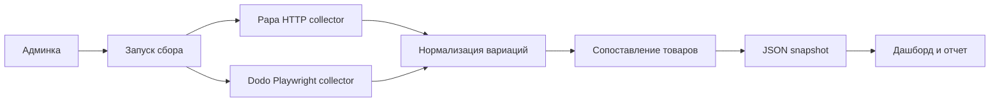

# Отчет: аналитика цен пицц

Дата: 30 июня 2026  
Город: Москва  
Наш ресторан: https://papajohns.ru/moscow  
Конкурент: https://dodopizza.ru/moscow

## 1. Ограничение задачи

Текущий этап рассматривает только пиццы.

Исключены:

- комбо;
- закуски;
- горячее;
- напитки;
- завтраки;
- десерты;
- соусы;
- другие товары;
- римские пиццы Dodo как отдельная продуктовая линейка.

Цены анализируются как базовые цены вариаций без промокодов, допов, замен ингредиентов и корзинных скидок.

## 2. Реализованный сборщик

Создан единый сборщик:

- `scripts/collect-pizzas.js`

Он пишет два файла:

- `data/pizza-snapshot.json` - машинный JSON-срез;
- `data/pizza-snapshot.js` - тот же срез для статического `index.html`.

Команды:

```bash
npm run collect
npm run collect:papa
npm run collect:dodo
```

Для быстрой отладки Dodo:

```bash
npm run collect -- --source=dodo --dodo-limit=5
```

## 3. Источники данных

### Papa Johns

Страница содержит `window.__PRELOADED_STATE__`.

Подход:

- HTTP-запрос к `https://papajohns.ru/moscow`;
- извлечение JS-состояния страницы;
- фильтрация товаров категории `pizza`;
- нормализация вариаций по размеру, тесту, корочке, цене и весу.

Фактически извлечено:

- 46 пицц;
- 689 вариаций.

Качество источника: высокое. Для регулярного сбора достаточно HTTP-запроса и JS/JSON-разбора состояния страницы.

### Dodo Pizza

Прямой HTTP-запрос к странице меню возвращает ServicePipe challenge, поэтому для Dodo используется Playwright.

Подход:

- запуск Chromium через Playwright;
- открытие `https://dodopizza.ru/moscow`;
- поиск раздела "Пиццы";
- извлечение карточек пицц;
- открытие конфигуратора каждой пиццы из карточки меню;
- перебор доступных размеров и видов теста;
- чтение базовой цены кнопки добавления в корзину;
- нормализация вариаций по размеру, тесту, цене и весу.

Фактически извлечено:

- 37 пицц;
- 245 вариаций.

Позиции без снятых вариаций:

- нет.

Важное наблюдение по Dodo: прямые product URL открываются стабильнее, но для части пицц не показывают 20 см вариант. Поэтому итоговый сбор открывает конфигуратор именно из карточек меню, а не по прямой ссылке товара. Для защиты от нестабильной гидратации интерфейса добавлены повторные попытки загрузки меню и открытия товара.

## 4. Сопоставление товаров

На первом этапе используется контролируемое ручное сопоставление 9 пар пицц:

| Papa Johns | Dodo Pizza | Статус |
|---|---|---|
| Пепперони | Пепперони | exact |
| Сырная | Сырная | exact |
| Ветчина и грибы | Ветчина и грибы | exact |
| Мясная | Мясная | exact |
| Маргарита | Маргарита | exact |
| Гавайская | Гавайская | exact |
| Карбонара | Любимая Карбонара | review |
| Цыпленок барбекю | Цыпленок барбекю | exact |
| Цыпленок ранч | Цыпленок ранч | review |

Внутри каждой пары сравнение идет не по минимальной цене, а по общим вариациям:

- размер;
- вид теста;
- базовая цена;
- вес, если он есть в источнике.

Сейчас найдено 36 совпавших вариаций `размер + тесто`.

Важно: размеры сетей не полностью совпадают. Например, у Papa Johns встречаются 23 / 30 / 35 / 40 см, а у Dodo - 20 / 25 / 30 / 35 см. Поэтому дашборд отдельно показывает:

- совпавшие вариации;
- вариации только Papa Johns;
- вариации только Dodo Pizza.

## 5. Проверка парсеров

### Playwright

Репозиторий: https://github.com/microsoft/playwright  
Документация: https://playwright.dev/docs/intro

Проверка:

- npm package: `playwright`;
- текущая установленная версия: 1.61.1;
- лицензия: Apache-2.0;
- Node.js: >=18;
- зависимости: `playwright-core`, optional `fsevents`;
- браузерные бинарники ставятся отдельной командой `npx playwright install chromium`.

Оценка безопасности установки: лучший вариант из трех. Небольшое дерево зависимостей, понятный источник, явный шаг скачивания браузерных бинарников.

Оценка пригодности: лучший первый выбор. Покрывает Dodo, где нужен браузерный рендер, и не усложняет Papa Johns.

### Crawlee

Репозиторий: https://github.com/apify/crawlee  
Документация: https://crawlee.dev/js/docs/introduction

Проверка:

- npm package: `crawlee`;
- текущая версия npm: 3.17.0;
- лицензия: Apache-2.0;
- Node.js: >=16;
- Playwright и Puppeteer являются optional peer dependencies;
- добавляет собственные пакеты `@crawlee/*`, storage, queue, browser-pool, retry/session tooling.

Оценка безопасности установки: приемлемо, но тяжелее Playwright. Пакет официальный и зрелый, но зависимостей больше.

Оценка пригодности: хороший второй этап, когда появится несколько конкурентов, очередь страниц, расписание, retry policy и централизованное хранение результатов.

### Scrapegraph AI

Репозиторий: https://github.com/ScrapeGraphAI/Scrapegraph-ai  
Документация: https://docs.scrapegraphai.com/introduction

Проверка:

- PyPI package: `scrapegraphai`;
- текущая версия PyPI: 2.1.4;
- Python: >=3.12,<4.0;
- wheel без `setup.py`;
- зависимости включают LangChain, OpenAI/Mistral/AWS/Ollama-интеграции, `playwright`, `undetected-playwright`, `free-proxy`, `ddgs`, `tiktoken`.

Оценка безопасности установки: самый высокий операционный риск из трех. Не потому что пакет обязательно небезопасен, а потому что дерево зависимостей большое, есть LLM- и proxy-компоненты, а результат сложнее сделать детерминированным.

Оценка пригодности: не подходит для первого этапа ценовой аналитики. Цены должны собираться проверяемым кодом, а LLM лучше использовать позже для сопоставления названий и текстовых выводов.

## 6. Дашборд

Файл `index.html` переделан под подробную аналитику вариаций.

Показывается:

- KPI по Papa Johns, Dodo Pizza, сопоставлениям и качеству сбора;
- карточки сопоставленных пицц;
- ручное сравнение любой пиццы Papa Johns с любой пиццей Dodo Pizza;
- выбор метода ручного сравнения: строгий `размер + тесто` или обзорный `только размер`;
- сравнение совпавших вариаций `размер + тесто`;
- ценовой разрыв по каждой общей вариации;
- лучший/худший заметный разрыв внутри пары;
- вариации только Papa Johns;
- вариации только Dodo Pizza;
- Papa Johns пиццы без товарного совпадения;
- Dodo Pizza пиццы без товарного совпадения;
- Dodo-позиции, которые нужно доснять, если будущий запуск не смог снять вариации.

Отдельно исправлена верстка цен: длинные значения теперь не выходят за рамки элементов, карточки и чипы ограничивают ширину, а данные Dodo по размерам и тесту отображаются наравне с Papa Johns.

## 7. Рекомендация по внедрению

Минимальная схема для админки:



OpenAI API стоит использовать не для извлечения цен, а для задач, где полезна семантика:

- предложить пары похожих пицц;
- объяснить, почему совпадение требует проверки;
- сгруппировать похожие ингредиенты;
- сформировать управленческий вывод по ценовой политике.

Сами цены лучше продолжать собирать детерминированным кодом через HTTP/Playwright.

## 8. Следующие шаги

1. Вынести ручные соответствия в отдельный конфигурационный файл.
2. Добавить GitHub Action для обновления `data/pizza-snapshot.json` по расписанию или вручную.
3. Добавить экспорт CSV/XLSX для аналитика.
4. Добавить контроль качества: падать, если `minPrice` Dodo не совпадает с карточной ценой или товар остался без вариаций.
5. Подключить OpenAI API для предлагаемых матчей, но сохранять ручное подтверждение перед попаданием в отчет.
